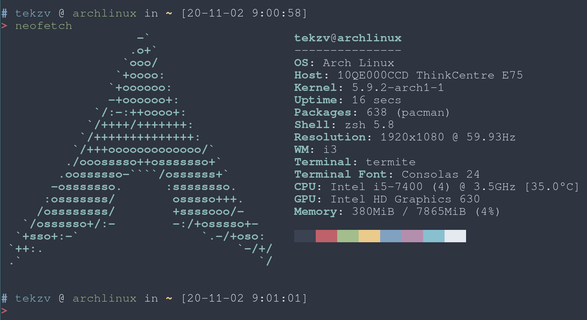

Yet another zsh theme based on [ys.zsh-theme](https://gist.github.com/ysmood/6110461).

## How to use?

### [zinit](https://github.com/zdharma/zinit)

Update your `.zshrc` file with the following three lines(order matters):

```bash
zinit snippet OMZ::lib/git.zsh
zinit snippet OMZ::lib/theme-and-appearance.zsh
zinit light "tinyRatP/ys"
```
